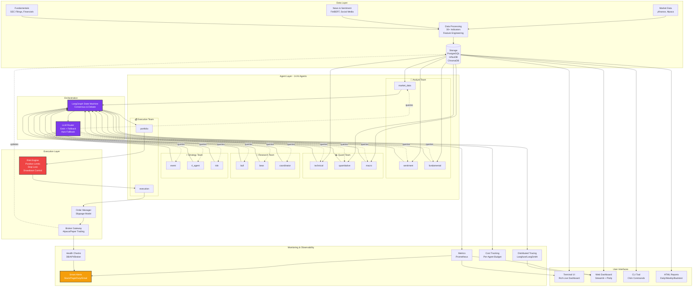

# NEXUS — Autonomous Multi-Agent Hedge Fund

<div align="center">

```
 ███╗   ██╗███████╗██╗  ██╗██╗   ██╗███████╗
 ████╗  ██║██╔════╝╚██╗██╔╝██║   ██║██╔════╝
 ██╔██╗ ██║█████╗   ╚███╔╝ ██║   ██║███████╗
 ██║╚██╗██║██╔══╝   ██╔██╗ ██║   ██║╚════██║
 ██║ ╚████║███████╗██╔╝ ╚██╗╚██████╔╝███████║
 ╚═╝  ╚═══╝╚══════╝╚═╝   ╚═╝ ╚═════╝ ╚══════╝
```

**Production-ready autonomous trading platform where 14 AI agents collaborate to analyze markets and execute trades**

[](https://github.com/kushalsai-01/nexus-financial-agent/actions/workflows/ci.yml)
[](https://www.python.org/downloads/)
[](https://github.com/psf/black)
[](https://mypy-lang.org/)

[Quick Start](#-quick-start) • [Architecture](#-architecture) • [Features](#-features) • [Documentation](#-documentation)

</div>

---

## 🎯 What is NEXUS?

NEXUS is a fully autonomous hedge fund system that uses **14 specialized AI agents** working together across **5 teams** to analyze financial markets and make trading decisions. Think of it as a digital trading desk where each agent has a specific role — from gathering market data to executing trades — all coordinated by AI to work as one intelligent system.

**Key Stats:**
- 🤖 14 AI agents across 5 specialized teams
- 📊 30+ technical indicators with automatic analysis
- 💰 Full risk management with position limits and stop-loss
- 🎨 Beautiful terminal UI + web dashboard
- 📈 Complete backtesting engine with walk-forward testing
- 🔍 Real-time monitoring with cost tracking and alerts
- 🚀 One-command deployment with Docker and Kubernetes

---

## 🏗️ Architecture



---

## ✨ Features

### 🤖 Multi-Agent Intelligence

**5 Specialized Teams, 14 AI Agents:**
- **🔬 Analyst Team** — Collects and analyzes market data, news sentiment, and fundamentals
- **📊 Quant Team** — Technical analysis, quantitative modeling, macroeconomic signals
- **🔎 Research Team** — Bull/bear debate system with coordinator for consensus
- **⚡ Strategy Team** — Event-driven strategies, reinforcement learning, risk assessment
- **💰 Execution Team** — Portfolio optimization and trade execution

**AI-Powered:**
- Multi-LLM support (Grok, Claude, GPT-4o) with automatic fallback
- LangGraph orchestration for complex agent workflows
- Debate and consensus mechanisms for better decisions
- Per-agent cost tracking and budget management

### 📊 Data & Analysis

- **Real-time market data** from multiple sources (yfinance, Alpaca)
- **30+ technical indicators** — RSI, MACD, Bollinger Bands, etc.
- **Sentiment analysis** — FinBERT NLP on news and social media
- **Fundamental analysis** — SEC filings, earnings, financials
- **Feature engineering** — Returns, volatility, z-scores, correlation

### 💹 Trading & Risk

- **Backtesting engine** with walk-forward testing and Monte Carlo simulation
- **Risk management** — Position limits, stop-loss, drawdown controls, VaR
- **Order execution** — Paper trading and simulated execution
- **Slippage modeling** — Realistic trade simulation
- **Performance metrics** — Sharpe, Sortino, Calmar, max drawdown

### 📡 Monitoring & Observability

**Production-ready monitoring:**
- 🔍 **Distributed tracing** — Langfuse and LangSmith integration
- 📊 **Prometheus metrics** — API latency, decision rate, portfolio value
- 🚨 **Smart alerting** — Slack, PagerDuty, Email with severity routing
- 💰 **Cost tracking** — Per-agent LLM costs with daily budgets
- 🏥 **Health checks** — Database, APIs, broker connectivity

### 🎨 User Interfaces

**Multiple ways to interact:**
- **Terminal UI** — Beautiful live dashboard with Rich (4 FPS refresh)
- **Web Dashboard** — Streamlit app with 5 pages and interactive Plotly charts
- **CLI Tool** — Full command-line interface for all operations
- **HTML Reports** — Professional daily, weekly, and backtest reports

### 🚀 Infrastructure

**Production-ready deployment:**
- 🐳 Docker + Docker Compose for local development
- ☸️ Kubernetes manifests with probes and resource limits
- 🏗️ Terraform for AWS infrastructure (VPC, RDS, ECR)
- 🔄 CI/CD with GitHub Actions
- 📝 Comprehensive documentation and type safety

---

## 🚀 Quick Start

### Prerequisites

```bash
Python 3.11+
Docker (optional)
API key: xAI Grok (GROK_API_KEY)   # only key required
```

### Required Environment Variables

Create a `.env` file in the project root (or export the variables):

```bash
# ── Required ────────────────────────────────────────────
GROK_API_KEY=xai-...          # xAI Grok – the only LLM key you need

# ── Optional (broker / data) ────────────────────────────
ALPACA_API_KEY=               # Alpaca paper-trading key
ALPACA_API_SECRET=            # Alpaca secret
NEWS_API_KEY=                 # NewsAPI.org key

# ── Optional (monitoring) ───────────────────────────────
LANGFUSE_PUBLIC_KEY=
LANGFUSE_SECRET_KEY=
SLACK_WEBHOOK_URL=
```

> **Tip:** `XAI_API_KEY` is accepted as an alias for `GROK_API_KEY`.

### Install & Run

```bash
# Clone repository
git clone https://github.com/kushalsai-01/nexus-financial-agent.git
cd nexus-financial-agent

# Create virtual environment
python -m venv .venv
.venv\Scripts\activate  # Windows
# source .venv/bin/activate  # macOS/Linux

# Install dependencies
pip install -e ".[dev]"

# Setup configuration
nexus init
# Edit .env with your GROK_API_KEY
```

### Run Your First Analysis

```bash
# Demo mode (simulated data)
nexus run -t AAPL -t MSFT --demo

# Live analysis
nexus run -t AAPL -t NVDA -t GOOGL --capital 100000 --paper

# Quick health check
nexus status

# Open web dashboard
nexus dashboard
```

---

## 💻 Usage Examples

### CLI Commands

```bash
# Initialize project with default config
nexus init

# Run analysis with terminal UI
nexus run -t AAPL -t MSFT -t GOOGL --capital 100000

# Backtest a strategy
nexus backtest -t AAPL -s 2023-01-01 -e 2024-01-01 --format html -o report.html

# Deep analysis on a ticker
nexus analyze -t TSLA --depth deep

# Generate daily report
nexus report --type daily --format html

# Check system status
nexus status

# View LLM costs
nexus costs --format json

# Launch web dashboard
nexus dashboard --port 8501
```

### Docker Deployment

```bash
# Start all services
cd docker && docker compose up -d

# Check logs
docker compose logs -f nexus

# Stop services
docker compose down
```

### Kubernetes Deployment

```bash
# Deploy to cluster
kubectl apply -f deploy/k8s/

# Check status
kubectl get pods -n nexus

# View logs
kubectl logs -n nexus -l app=nexus-agent -f
```

---

## 🛠️ Tech Stack

| Layer | Technology |
|-------|-----------|
| **Language** | Python 3.11+ with full type hints |
| **AI/LLM** | Grok (xAI), Claude (Anthropic), GPT-4o (OpenAI) |
| **Orchestration** | LangGraph, LangChain |
| **Data** | yfinance, Alpaca, FinBERT |
| **Databases** | PostgreSQL 16, InfluxDB 2.7, ChromaDB |
| **Terminal UI** | Rich (Live, Layout, Tables) |
| **Web Dashboard** | Streamlit + Plotly |
| **CLI** | Click |
| **Monitoring** | Langfuse, Prometheus, Slack/PagerDuty |
| **Testing** | pytest, pytest-asyncio, pytest-cov |
| **Type Safety** | Pydantic v2, mypy (strict mode) |
| **Deployment** | Docker, Kubernetes, Terraform |
| **CI/CD** | GitHub Actions |

---

## 📁 Project Structure

<details>
<summary>Click to expand full directory tree</summary>


```
nexus-financial-agent/
├── nexus/                       # Main application
│   ├── core/                    # Foundation (config, types, exceptions, logging)
│   ├── data/                    # Data pipeline (providers, storage, processors)
│   ├── agents/                  # 14 AI agents (analyst, quant, research, strategy, execution)
│   ├── orchestration/           # LangGraph workflow & state management
│   ├── llm/                     # LLM integration (Anthropic, OpenAI, router)
│   ├── backtest/                # Backtesting engine & metrics
│   ├── risk/                    # Risk management & monitoring
│   ├── execution/               # Order execution & broker integration
│   ├── analysis/                # Advanced analytics & optimization
│   ├── monitoring/              # Tracing, metrics, alerts, health checks
│   ├── reports/                 # Report generators (daily, weekly, backtest)
│   ├── ui/                      # Terminal UI, web dashboard, themes
│   └── cli/                     # Click CLI commands
├── deploy/
│   ├── k8s/                     # Kubernetes manifests
│   ├── terraform/               # AWS infrastructure as code
│   └── deploy.sh                # Deployment automation script
├── docker/                      # Docker & docker-compose
├── tests/                       # Unit & integration tests
├── config/                      # YAML configuration files
├── docs/                        # Detailed documentation
└── pyproject.toml               # Dependencies & project metadata
```

</details>

---

## ⚙️ Configuration

NEXUS uses layered configuration (YAML + environment variables):

```yaml
# config/nexus.yaml
risk:
  max_position_size_pct: 5.0      # Max 5% per position
  max_drawdown_pct: 10.0          # Stop if 10% drawdown
  daily_loss_limit_pct: 3.0       # Stop if 3% daily loss
  position_limit: 20              # Max 20 positions

monitoring:
  prometheus:
    enabled: true
    port: 9090
  langfuse:
    enabled: true
    public_key: ${LANGFUSE_PUBLIC_KEY}

llm:
  primary:
    provider: grok
    model: grok-3
    temperature: 0.1
  fallback:
    provider: grok
    model: grok-3
```

---

## 🧪 Development

```bash
# Run tests
make test

# Run tests with coverage
make test-cov

# Format code
make format

# Type check
make typecheck

# Lint
make lint

# All checks
make all
```

---

## 📚 Documentation

- [Architecture Guide](docs/architecture.md) — System design and agent workflows
- [API Reference](docs/api.md) — Complete API documentation
- [Deployment Guide](docs/deployment.md) — Production deployment instructions
- [Contributing Guide](CONTRIBUTING.md) — How to contribute

---

## 🤝 Contributing

We welcome contributions! Please see [CONTRIBUTING.md](CONTRIBUTING.md) for details.

---

## 📝 License

Private — All rights reserved.

---

## 🙏 Acknowledgments

Built with:
- [LangChain](https://langchain.com/) & [LangGraph](https://langchain-ai.github.io/langgraph/) for agent orchestration
- [xAI Grok](https://x.ai/) for primary AI intelligence
- [Anthropic Claude](https://www.anthropic.com/) & [OpenAI GPT-4](https://openai.com/) as optional alternatives
- [Rich](https://github.com/Textualize/rich) for beautiful terminal UI
- [Streamlit](https://streamlit.io/) for web dashboard
- [Alpaca](https://alpaca.markets/) for market data and paper trading

---

<div align="center">

**⭐ Star this repo if you find it useful!**

</div>
